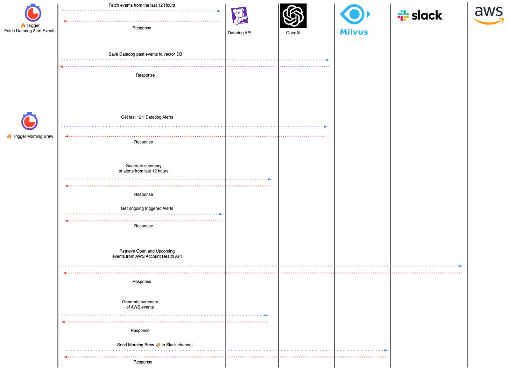

# SRE Buddy
**SRE Buddy** is an AI tool that helps SREs and DevOps teams to gain visibility into their systems and applications.
It is a chatbot that can be integrated with Slack and other messaging platforms. It can answer questions about the system, provide insights, and help with troubleshooting.

It uses techniques as RAG (Retrieval Augmented Generation) and Graph-based search to provide insights and answers to the user's questions.

**SRE Buddy** is under development and new features are being added. If you have any suggestions or want to contribute, please open an issue or a pull request. For contributions, please refer to the [Contributing Guide](CONTRIBUTING.md).


## Motivation
I created this project because I was spending a lot of time checking alerts, and events from different sources like Datadog, AWS Health, and others. 
I wanted to have a tool that can send me a morning report (a.k.a. The Morning Brew) with all the alerts and events from the last hours and ongoing alerts.
I am planning to expand this tool with chatbot capabilities, plug knowledge base and an AI agentic approach to help with troubleshooting and support tickets.

This project also provided an opportunity to refresh my skills in RAG, vector databases and chatbots.

## Data Sources
- [Datadog Events](https://docs.datadoghq.com/api/latest/events/)
- [AWS Health API](https://docs.aws.amazon.com/health/latest/APIReference/Welcome.html)
- Kubernetes (Coming soon)
- Prometheus (Coming soon)
- Knowledge Base (Coming soon)
- And more...

Here is a list of applications and tools used by the SRE Buddy and their respective configurations:

| Application                           | Environment Variables | Description                                                     |
|---------------------------------------|---|-----------------------------------------------------------------|
| [Slack](slack.com)                    | SLACK_TOKEN | Token to allow to send messages to Slack                        |
|                                       | SLACK_CHANNEL | The slack channel to send the notifications                     |
| [Datadog](https://www.datadoghq.com/) | DD_SITE  | The Datadog Site URL                                            |
|                                       | DD_API_KEY | The Datadog API key                                             |
|                                       | DD_APP_KEY | The Datadog Application key                                     |
|                                       | DD_LAST_EVENTS_HOUR | Number of hours for fetching past events                        |
| [OpenAI](https://openai.com/)         | OPENAI_MODEL_LLM | The name of the OpenAI model for RAG                            |
|                                       | OPENAI_API_KEY       | The OpenAI API key                                              |
|          | OPENAI_EMBEDDED_MODEL_LLM       | The name of the OpenAI model for generate embeddings            |
| [Milvus](milvus.io)                   | MILVUS_URI       | The URI where the Milvus Database listen along with credentials |
| [AWS](https://aws.amazon.com/)                               | AWS_ACCESS_KEY_ID       | AWS Access Key                                                  |
|                                       | AWS_SECRET_ACCESS_KEY       | AWS Secret Key                                                  |

An example of environment variables is provided in the `.env.example` file.

## Setup
> [!IMPORTANT]
> SRE-Buddy depends on [Milvus](https://milvus.io/intro). To run a standalone instance of Milvus on docker, you can follow [these instructions](https://milvus.io/docs/install_standalone-docker.md)

1. Clone the repository:
```
git clone https://github.com/Trint-ai/sre-buddy.git
```

2. Configure environment variables:
```
cp src/.env.example src/.env
```

3. Install python libraries:
```
cd src
pip install -r requirements.txt
```

4. Run the application:
```
cd app
python main.py
```

### [Optionally] Run with Docker

1. Build the docker image:
```
docker build -t sre-buddy .
```

2. Run sre-buddy with Docker:
```
docker run -t sre-buddy
```


## How it works
At this moment only the Datadog Events and AWS Health API are integrated with the SRE Buddy.
Both data sources are enabled using the environment variables:
```
ENABLE_DATADOG
ENABLE_AWS
```

These data sources are fetched using an scheduler configured by the following environment variable `SCHEDULER_DD_ALERT_EVENTS`.

An integration called ***The Morning Brew*** ☕ is triggered when the environment variable `ENABLE_MORNING_BREW` is set to `True` and is triggered based on the setup of the following environment variable: `SCHEDULER_MORNING_BREW`.

A workflow of how it is implemented is shown in the next section.

***Keep in mind that this implementation is subject to changes.***

### Architecture



### Sample Message from the Morning Brew to Slack

```
☕ Here is your morning Brew

  

Here is a summary of Datadog alerts from the last 12 hours:

🔰 [P4] [Warn on {deliverystreamname:staging-delivery}] Kinesis Firehose delivery unsuccessful for staging-delivery  clusters (US)

🔰 [P3] [Warn on {queuename:batch-sentiment-processing}] SQS too many messages in batch-sentiment-processing

🔰 [P5] [Triggered on {deliverystreamname:production-delivery}] Firehose events are throttled on production-delivery

🔰 [P5] [Triggered] Failures in the analytics tracking pipeline ()

🔰 [P5] [Triggered] I/O wait (27.244) is high on prod1

There are currently 1 ongoing WARNING alerts:

⚠️ Staging product error message found <https://app.datadoghq.eu/monitors/12345|More information>

  

  

☁️ Here is a summary of AWS Health OPEN events:

  

🔰 Region: us-east-1

📅 Start time: 2024-11-21 00:31:18+01:00

📅 End time: N/A

📦 Affected Resources: qa-environment

📄 Details: A new service software update OpenSearch_2_17_R20241112-P1 has been scheduled for domain pentest in Region us-east-1 at 2024-11-24T00:00:00Z. Please see documentation for more information on scheduling software updates: https://docs.aws.amazon.com/opensearch-service/latest/developerguide/service-software.html

  

  

🔰 Region: eu-central-1

📅 Start time: 2024-11-22 23:15:37+01:00

📅 End time: N/A

📦 Affected Resources: testing-search2

📄 Details: A new service software update OpenSearch_2_17_R20241112-P2 is available for your domain(s) in eu-central-1 Region. Amazon OpenSearch Service regularly releases service software updates to improve the availability, performance, and resiliency of your domain. It is recommended that you install service software updates as soon as possible. Please see the following link for information on installing service software updates: https://docs.aws.amazon.com/opensearch-service/latest/developerguide/service-software.html
```


## Roadmap
- [ ] Add more data sources and integrations (Kubernetes, Knowledge Base, etc.).
- [ ] Add more LLM models (Ollama, Claude, etc.).
- [ ] Add Chatbot capabilities.
- [ ] Add capability to respond to incidents and alerts.
- [ ] Add capability to create incidents and alerts.
- [ ] Add capability to help with troubleshooting and support tickets using the knowledge base and other resources.

### Looking for a custom integration?
If you are looking for a custom integration, please contact me at [mail](mailto:albertollamaso@gmail.com) or open an issue.
